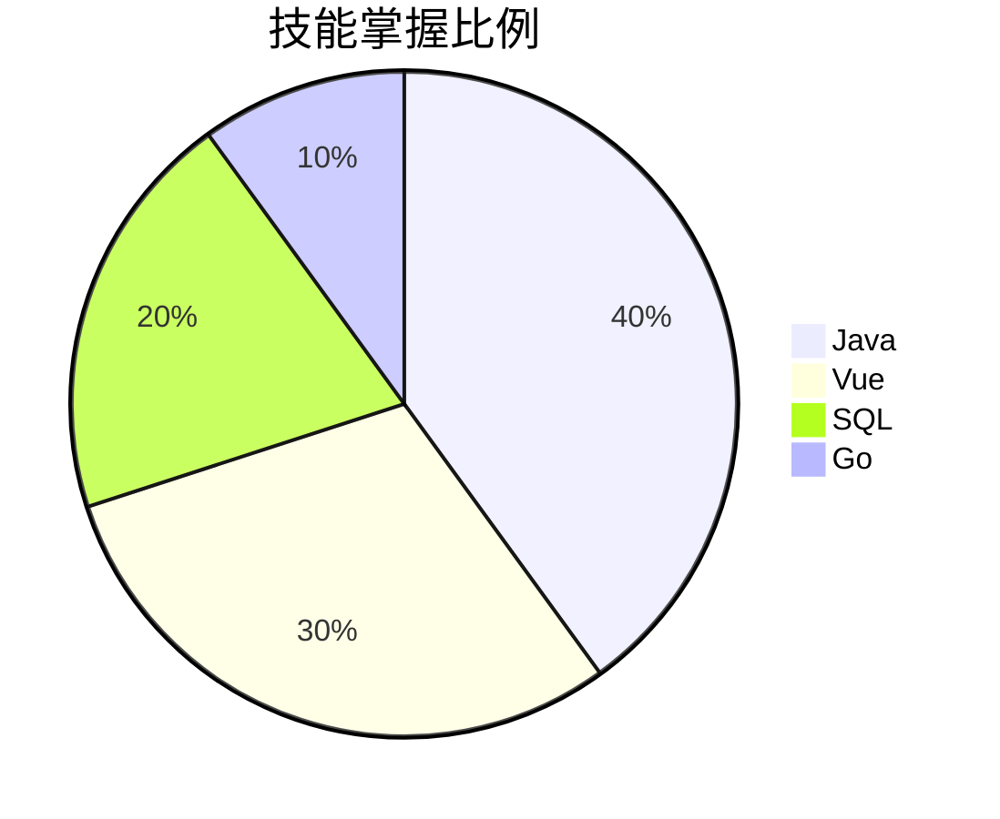

# 在 Markdown 中使用 Element Plus

由于已全局注册 Element Plus，您可以直接在 Markdown 中编写组件标签。

## 1. 基础展示 (无需 Script)

直接插入组件标签即可渲染。

### 按钮
<el-row class="mb-4">
  <el-button>Default</el-button>
  <el-button type="primary">Primary</el-button>
  <el-button type="success">Success</el-button>
  <el-button type="info">Info</el-button>
  <el-button type="warning">Warning</el-button>
  <el-button type="danger">Danger</el-button>
</el-row>

### 警告提示
 
<el-alert title="这是一条成功提示" type="success" show-icon />
 
<el-alert title="这是一条警告提示" type="warning" show-icon :closable="false" />

### 卡片
 
<el-card class="box-card" style="width: 300px">
  <template #header>
    

      卡片标题
    

  </template>
  

    列表内容 {{ o }}
  

</el-card>

---

## 2. 交互演示 (配合 Script)

### 计数器 (事件处理)
<el-button type="primary" @click="count++">点击 +1</el-button>
<el-tag size="large" style="margin-left: 10px">当前计数: {{ count }}</el-tag>

---

## 3. 饼图与比例展示

由于 Element Plus 核心库不包含复杂的图表，推荐以下方案：

### 方案 A：使用 Mermaid (推荐，适合简单图表)
Mermaid 是项目内置的，直接写代码即可：

### 方案 B：使用 Element Plus 环形进度条
适合展示单个维度的占比：

 
<el-row :gutter="20">
  <el-col :span="8" style="text-align: center">
    <el-progress type="circle" :percentage="80" />
    
项目进度

  </el-col>
  <el-col :span="8" style="text-align: center">
    <el-progress type="circle" :percentage="100" status="success" />
    
后端完成

  </el-col>
  <el-col :span="8" style="text-align: center">
    <el-progress type="circle" :percentage="30" status="warning" />
    
文档撰写

  </el-col>
</el-row>

---

## 4. 滑块示例 (双向绑定)

 
<el-slider v-model="sliderValue" />

当前选择的分值: {{ sliderValue }}
