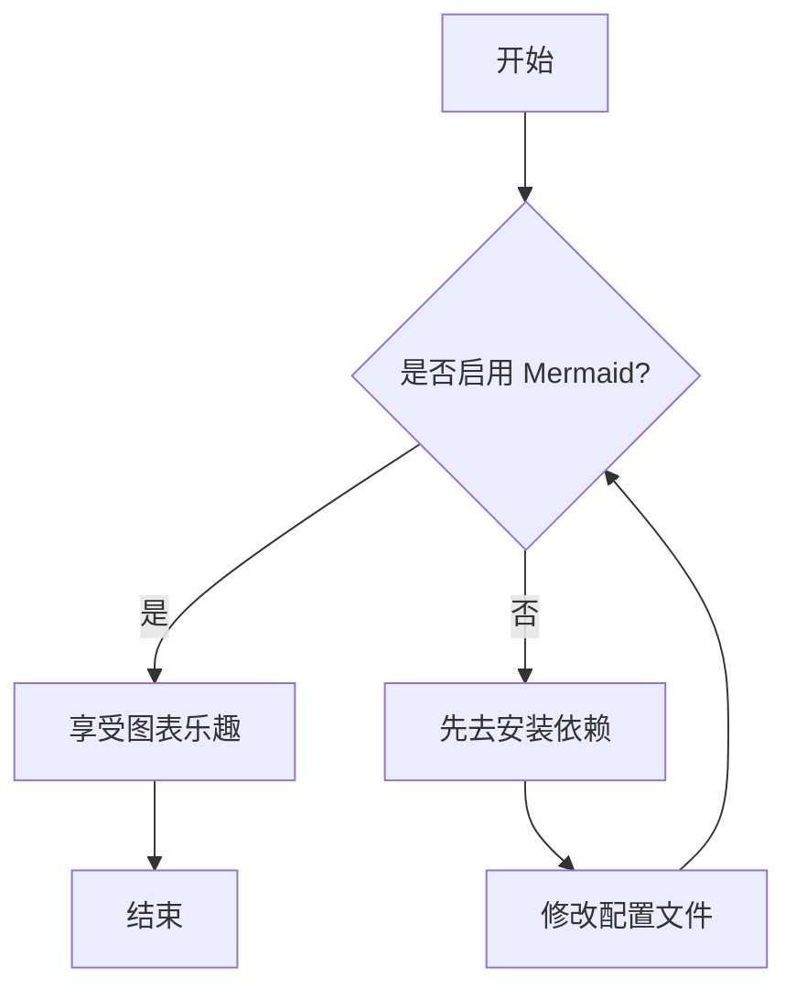
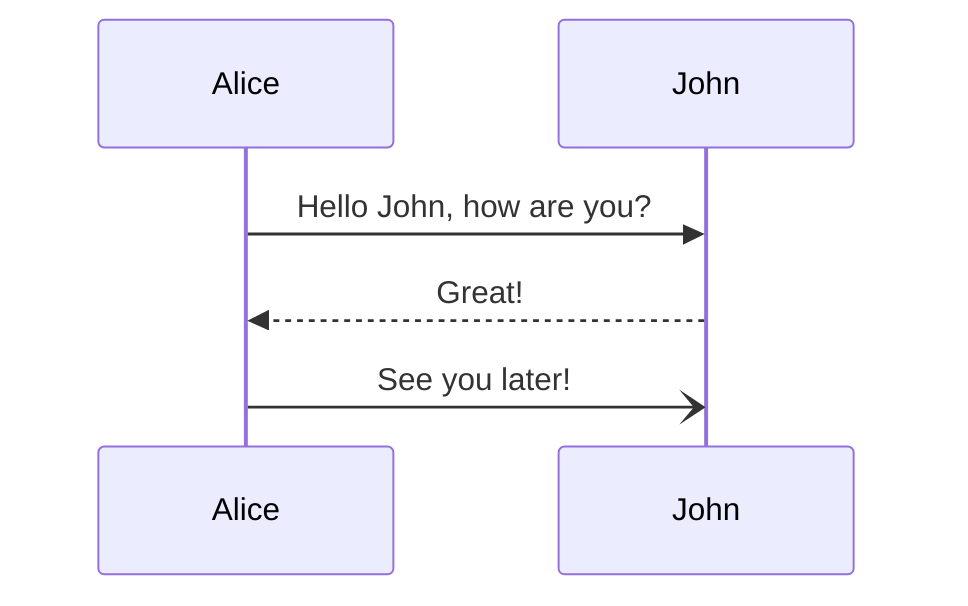
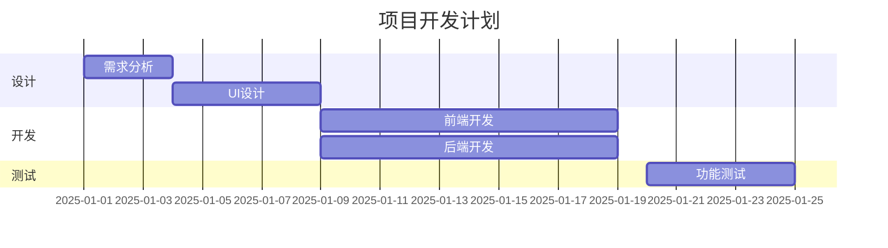

# Mermaid 图表示例

这是一个使用 Mermaid 语法的流程图示例。

## 流程图 (Flowchart)

```mermaid
flowchart TD
    A[开始] --> B{是否启用 Mermaid?}
    B -->|是| C[享受图表乐趣]
    B -->|否| D[先去安装依赖]
    D --> E[修改配置文件]
    E --> B
    C --> F[结束]
```

## 时序图 (Sequence Diagram)

```mermaid
sequenceDiagram
    Alice->>John: Hello John, how are you?
    John-->>Alice: Great!
    Alice-)John: See you later!
```

## 甘特图 (Gantt Chart)

```mermaid
gantt
    title 项目开发计划
    dateFormat  YYYY-MM-DD
    section 设计
    需求分析           :a1, 2025-01-01, 3d
    UI设计             :after a1  , 5d
    section 开发
    前端开发           :2025-01-09  , 10d
    后端开发           :2025-01-09  , 10d
    section 测试
    功能测试           :2025-01-20  , 5d
```
