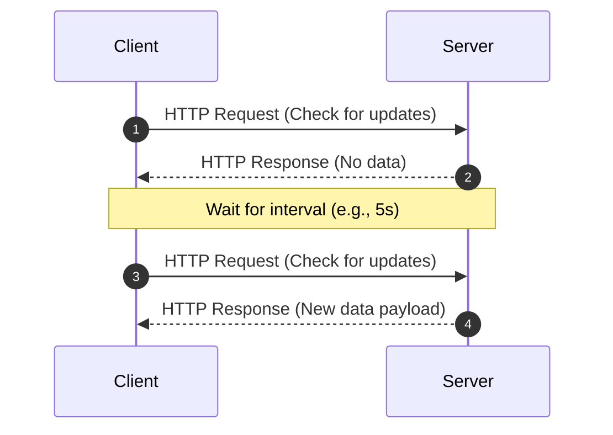
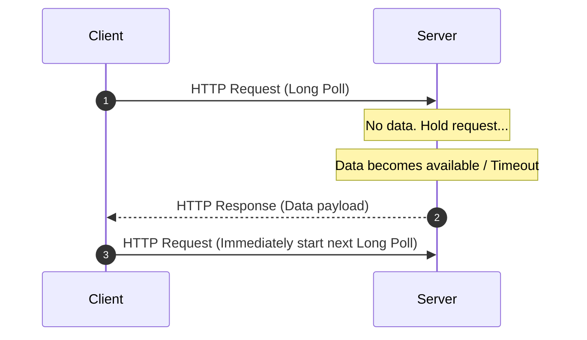
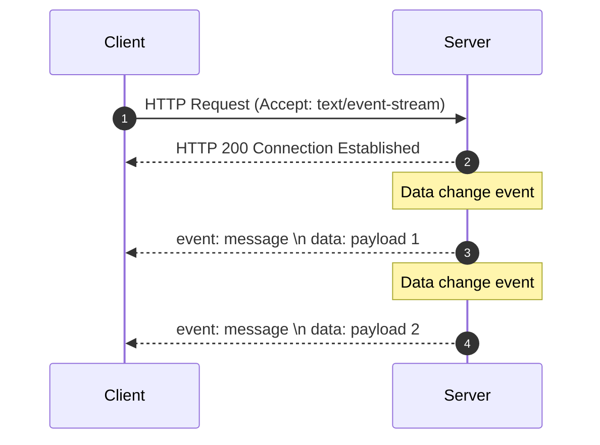
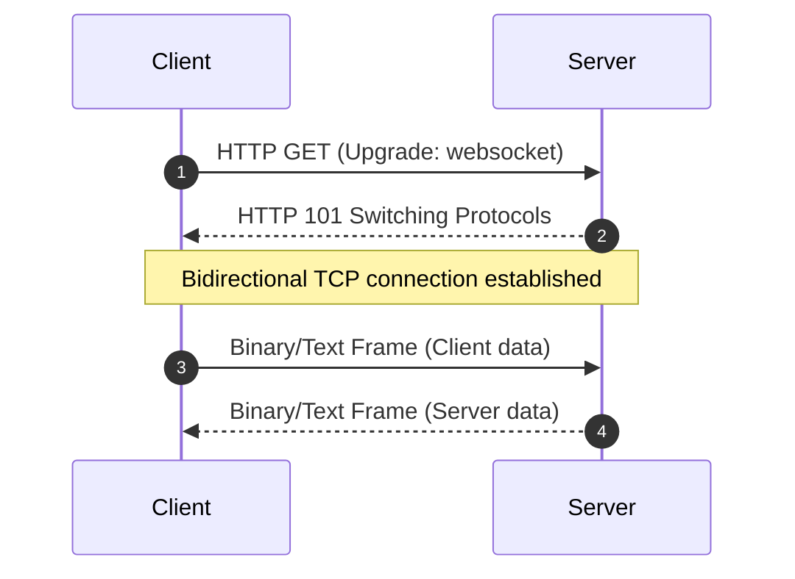

# Client-Server Communication Technologies

## What Is It?
Client-server communication technologies refer to the protocols and mechanisms used for exchanging data and commands between clients and servers. In modern web architectures, this extends beyond the traditional request-response model to include server-to-client push technologies and real-time bi-directional communication.

## Why It Matters
Choosing the right communication approach in distributed systems and modern web applications directly affects:
1. **Latency/Real-time Delivery**: Critical for applications like instant messaging (IM), collaborative tools, gaming, and config hot-reloading that require near-instant synchronization.
2. **Resource Efficiency**: Frequent connection creation or empty polls waste significant network bandwidth and server CPU/memory resources.
3. **Architectural Complexity**: Technologies like WebSocket and WebTransport require dedicated server support, state management, and connection heartbeat/reconnection logic, while others like Long Polling or SSE leverage standard HTTP infrastructure.

## How It Works

### 1. Short Polling
The client sends regular HTTP requests to the server at fixed intervals (e.g., every 5 seconds) to check for new data. The server responds immediately, whether data is available or not.
*   **Interaction Pattern**: Pull
*   **Connection Type**: Short-lived (HTTP/1.x)



### 2. Long Polling
The client sends an HTTP request, and the server suspends the response until new data becomes available or a timeout occurs. Once responded, the client processes the data and immediately initiates another long poll request.
*   **Interaction Pattern**: Pseudo-Push / Pull
*   **Connection Type**: Pseudo-long connection (HTTP/1.x)



### 3. Server-Sent Events (SSE)
The client establishes a persistent connection using standard HTTP with the `Accept: text/event-stream` header. The server keeps this connection open and pushes textual data updates sequentially as a stream. It is unidirectional and natively supports auto-reconnection.
*   **Interaction Pattern**: One-way Push
*   **Connection Type**: Persistent connection (HTTP/1.1 / HTTP/2)



### 4. WebSocket
The client and server perform an HTTP handshake to upgrade the protocol to WebSocket. Once upgraded, the underlying TCP connection remains open, allowing both parties to send lightweight message frames bidirectionally at any time.
*   **Interaction Pattern**: Bi-directional Real-time
*   **Connection Type**: Persistent TCP connection (WebSocket protocol)



### 5. Other Modern Protocols (gRPC Streaming, WebTransport)
*   **gRPC Streaming**: Built on top of HTTP/2, utilizing Protocol Buffers for fast, strongly-typed serialization. Supports server streaming and bidirectional streaming, commonly used in microservice-to-microservice communication and mobile backends.
*   **WebTransport**: Built on HTTP/3 (QUIC), supporting unidirectional and bidirectional streams as well as unordered, unreliable datagrams (UDP-like), eliminating head-of-line blocking issues inherent in TCP.

---

## Example: Config Reloading and Notification Push

### 1. Long Polling for Config Listeners (Java Example)
The server suspends the request using `DeferredResult` if no newer config version is available.

```java
@RestController
@RequestMapping("/config")
public class ConfigController {
    
    private final DeferredResultWrapper resultWrapper = new DeferredResultWrapper();

    @GetMapping("/listener")
    public DeferredResult<ResponseEntity<String>> watchConfig(@RequestParam String clientVersion) {
        DeferredResult<ResponseEntity<String>> deferredResult = new DeferredResult<>(30000L); // 30s timeout
        
        deferredResult.onTimeout(() -> {
            deferredResult.setResult(ResponseEntity.status(HttpStatus.NOT_MODIFIED).build());
        });

        if (ConfigCache.isOutdated(clientVersion)) {
            deferredResult.setResult(ResponseEntity.ok(ConfigCache.getCurrentConfig()));
        } else {
            resultWrapper.register(deferredResult);
        }
        
        return deferredResult;
    }
}
```

### 2. SSE Server Push (Java Spring Boot)
A simple unidirectional SSE emitter registration and broadcast mechanism.

```java
@RestController
@RequestMapping("/notification")
public class NotificationController {

    private final List<SseEmitter> emitters = new CopyOnWriteArrayList<>();

    @GetMapping("/stream")
    public SseEmitter streamNotifications() {
        SseEmitter emitter = new SseEmitter(Long.MAX_VALUE);
        emitters.add(emitter);
        
        emitter.onCompletion(() -> emitters.remove(emitter));
        emitter.onTimeout(() -> emitters.remove(emitter));
        
        return emitter;
    }

    public void publishEvent(String data) {
        for (SseEmitter emitter : emitters) {
            try {
                emitter.send(SseEmitter.event().data(data));
            } catch (IOException e) {
                emitters.remove(emitter);
            }
        }
    }
}
```

---

## Trade-offs and Comparison

| Feature / Dimension | Short Polling | Long Polling | SSE | WebSocket |
| :--- | :--- | :--- | :--- | :--- |
| **Real-time Latency**| Poor (depends on interval) | Good | Excellent | Excellent |
| **Bandwidth Overhead**| High (repeated headers) | Medium | Low | Extremely Low |
| **Server Overhead** | Low (no held connections) | High (long-held requests) | Medium (HTTP/2 multiplexing) | High (persistent connection state) |
| **Firewall/Proxy Friendly**| Yes | Yes | Yes | May require port 443 fallback |
| **Auto-Reconnection**| Controlled by client | Controlled by client | Built-in | Must be implemented in application |

### Decision Framework
*   **Config Hot-Reloading**: Use **Long Polling** or **SSE**.
    *   Long Polling (e.g., Apollo, early Nacos versions) works universally across corporate proxies and load balancers due to standard stateless HTTP requests.
    *   SSE is lighter and cleaner when HTTP/2 is available, avoiding request rebuild overhead.
*   **Server Push Notifications**: Use **SSE**.
    *   When communication is purely unidirectional (Server -> Client), SSE is less complex to configure and scale compared to WebSocket, providing native reconnection logic.
*   **Low-Latency Bidirectional Interaction (IM, Gaming, Collab)**: Use **WebSocket**.
    *   Full-duplex channels and negligible frame header overhead make WebSocket the ideal choice for simultaneous rapid updates from both client and server.
