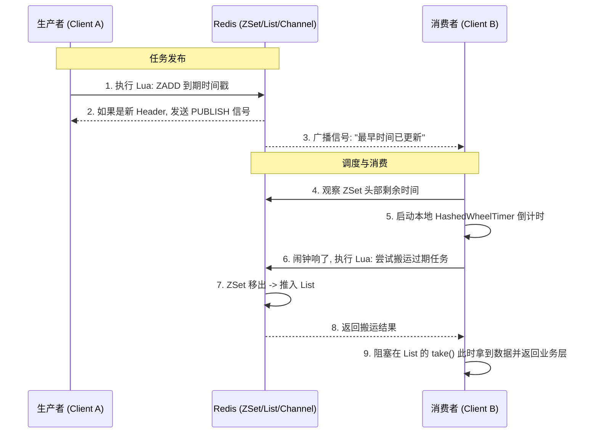

## Redis 延迟队列与redisson实现

### 1. 核心架构组件

Redisson 实现延迟队列并非只用了一个 Key，而是通过 **“三位一体”** 的结构来平衡性能与可靠性：

* **`zset` (timeout_set)**：**任务仓库**。按到期时间戳（Score）排序存放所有未到期的任务。
* **`list` (blocking_queue)**：**就绪队列**。仅存放“已经到期”的任务，供业务逻辑通过 `take()` 消费。
* **`channel` (pubsub_channel)**：**调度中心**。用于在分布式节点间同步“最早到期时间”的信号。

---

### 2. 核心机制：现实问题 vs 解决方案

| 现实中的工程难题 | Redisson 的应对方案 | 设计巧妙之处 |
| --- | --- | --- |
| **轮询开销** | **HashedWheelTimer (本地时间轮)** | 客户端根据 ZSet 头部任务时间进行本地倒计时，**无需高频请求 Redis**。 |
| **任务抢占竞争** | **Lua 脚本原子操作** | 判定过期、从 ZSet 移出、推入 List 在同一个脚本完成，**确保任务不被重复消费**。 |
| **新任务插队** | **Pub/Sub 实时通知** | 当有更早的任务插入时，生产者发布信号，**强制所有消费者更新本地倒计时**。 |
| **时钟漂移误差** | **参数校验与二次调度** | Lua 脚本根据传参比对，若因误差取不到数据则返回剩余毫秒数，客户端进行 **ms 级重试**。 |
| **消费阻塞感** | **List 的 BLPOP 模式** | 业务端直接 `take()` 阻塞，像操作普通 MQ 一样简单，屏蔽了底层的各种搬运逻辑。 |

---

### 3. 发布订阅（Pub/Sub）的同步逻辑

这是解决“实时性”的关键。当分布式环境下的多个客户端共同操作一个队列时：

1. **信号源（Publisher）**：当任何一个客户端 `offer` 任务且该任务排在 ZSet 第一位时，Lua 脚本发出 `PUBLISH` 信号。
2. **信号传播**：Redis 服务端将信号广播给所有订阅了该队列的消费者。
3. **响应动作（Subscriber）**：
* 消费者收到通知后，立即检查 ZSet 头部。
* 如果发现新的到期时间比当前本地定时器更早，则**取消旧定时器，启动新定时器**。
* 这确保了即使新任务只延迟 1 秒，也能被立即感知。

---

### 4. 架构交互流程图

---

### 5. 异常场景处理总结

* **如果消费者挂了**：任务会一直留在 ZSet 中。当任何一个新的消费者启动时，会触发一次扫描逻辑，将 ZSet 中所有已过期的任务批量搬运到 List，实现**自动补偿**。
* **如果 Redis 挂了**：开启 AOF 持久化后，ZSet 和 List 都会恢复。由于逻辑都在 Lua 中，恢复后系统会自动回到正确状态。
* **时钟不同步**：系统容忍毫秒级的时钟漂移。若漂移过大，Lua 脚本会作为“裁判员”返回正确的剩余时间，修正客户端的下一次触发。

---