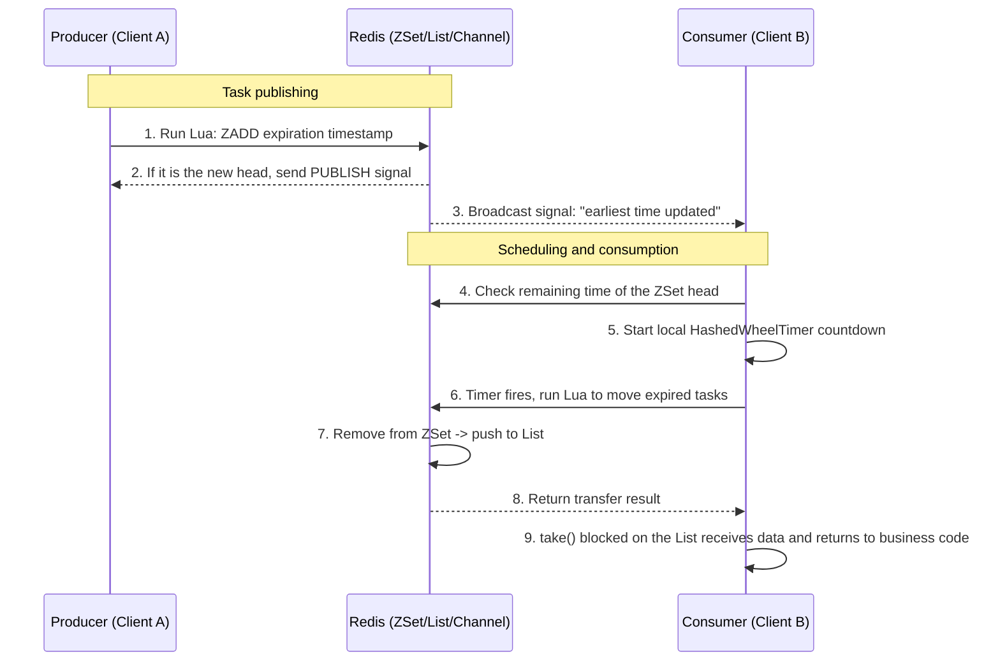

## Redis Delayed Queue and Redisson Implementation

### 1. Core Architecture Components

Redisson does not implement delayed queues with a single Redis key. Instead, it balances performance and reliability through a **three-part structure**:

* **`zset` (timeout_set)**: **Task storage**. Stores all pending tasks and sorts them by expiration timestamp as the score.
* **`list` (blocking_queue)**: **Ready queue**. Stores only expired tasks, which business code consumes through `take()`.
* **`channel` (pubsub_channel)**: **Scheduling coordinator**. Synchronizes the "earliest expiration time" signal across distributed nodes.

---

### 2. Core Mechanisms: Real-World Problems vs. Solutions

| Engineering challenge | Redisson solution | Why the design works well |
| --- | --- | --- |
| **Polling overhead** | **HashedWheelTimer (local timing wheel)** | The client starts a local countdown based on the first task in the ZSet, so it **does not need to query Redis frequently**. |
| **Task claiming race conditions** | **Atomic Lua scripts** | Expiration checks, ZSet removal, and List insertion happen in one script, **preventing duplicate consumption**. |
| **Earlier task insertion** | **Real-time Pub/Sub notification** | When a newly inserted task expires earlier than the current head, the producer publishes a signal that **forces all consumers to refresh their local timers**. |
| **Clock drift** | **Parameter validation and rescheduling** | The Lua script validates the input parameters. If a timing mismatch prevents task movement, it returns the remaining milliseconds so the client can retry with **millisecond-level precision**. |
| **Blocking consumption experience** | **List BLPOP mode** | Business code simply blocks on `take()`, just like consuming from a normal message queue, while the internal task transfer logic stays hidden. |

---

### 3. Pub/Sub Synchronization Logic

This is the key to real-time responsiveness. When multiple clients operate on the same queue in a distributed environment:

1. **Signal source (Publisher)**: When any client calls `offer` and the task becomes the first item in the ZSet, the Lua script sends a `PUBLISH` signal.
2. **Signal propagation**: Redis broadcasts the signal to all consumers subscribed to this queue.
3. **Response action (Subscriber)**:
* After receiving the notification, the consumer immediately checks the head of the ZSet.
* If the new expiration time is earlier than the current local timer, it **cancels the old timer and starts a new one**.
* This ensures that even a task delayed by only one second can be detected immediately.

---

### 4. Architecture Interaction Flow

```mermaid
sequenceDiagram
    participant P as Producer (Client A)
    participant R as Redis (ZSet/List/Channel)
    participant C as Consumer (Client B)

    Note over P, R: Task publishing
    P->>R: 1. Run Lua: ZADD expiration timestamp
    R-->>P: 2. If it is the new head, send PUBLISH signal
    R-->>C: 3. Broadcast signal: "earliest time updated"

    Note over C, R: Scheduling and consumption
    C->>R: 4. Check remaining time of the ZSet head
    C->>C: 5. Start local HashedWheelTimer countdown
    C->>R: 6. Timer fires, run Lua to move expired tasks
    R->>R: 7. Remove from ZSet -> push to List
    R-->>C: 8. Return transfer result
    C->>C: 9. take() blocked on the List receives data and returns to business code

```

---

### 5. Failure Scenario Summary

* **If a consumer crashes**: Tasks remain in the ZSet. When any new consumer starts, it triggers a scan and moves all expired tasks from the ZSet to the List in batches, providing **automatic compensation**.
* **If Redis crashes**: With AOF persistence enabled, both the ZSet and List can be restored. Because the core logic runs in Lua scripts, the system can recover to the correct state after restart.
* **If clocks are not synchronized**: The system can tolerate millisecond-level clock drift. If the drift is too large, the Lua script acts as the source of truth by returning the correct remaining time and correcting the client's next trigger.

---
